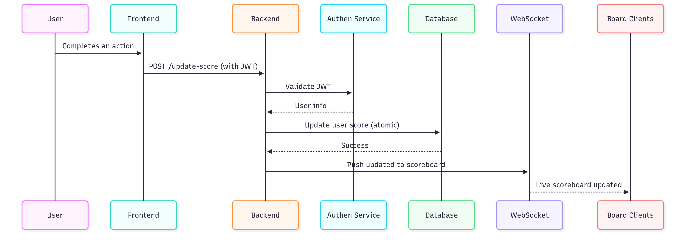

# 📘 Overview

This module handles secure score updates for users and live score broadcast to clients. It ensures 🚀🚀🚀

- Score manipulation is prevented.

- Score updates are only triggered by legitimate, authorized actions.

- Real-time scoreboard updates (top 10).

# ⚙️ High Architecture



# 📌 Endpoints

### List APIs as below

#### API 1

- Endpoint: POST `/api/score/update`

- Description:
  Triggered by a valid user action. Authenticated call that increments the user’s score securely.

- Header

```makefile
Authorization: Bearer <JWT Token>
```

- Body

```json
{
  "actionId": "some-unique-identifier"
}
```

- Response

```json
{
  "success": true,
  "newScore": 1450
}
```

- Validations

  - JWT must be valid and not expired.

  - `actionId` must be unique and verifiable.

  - Optional: throttle updates (rate-limiting per minute).

# 🗃️ Database Structure

```sql
TABLE users (
  id UUID PRIMARY KEY,
  username TEXT,
  score INTEGER,
  last_updated TIMESTAMP
)

INDEX ON score DESC
```

# 📡 WebSocket

- Endpoint: `/ws/scoreboard`

- Description:

  - Broadcasts top 10 scores in real-time to all connected clients.
  - Emitted after every valid score update.

- Payload

```json
{
  "leaderboard": [
    { "username": "Alice", "score": 2010 },
    { "username": "Bob", "score": 1980 },
    ...
  ]
}
```

# ⏱️ Real-Time Broadcast Flow

- Score update succeeds in DB.

- Top 10 queried from DB (ORDER BY score DESC LIMIT 10).

- Result pushed via WebSocket.

# 🔐 Security Measures

- Authentication: All API calls require a valid JWT.

- Rate Limiting: Throttle score update endpoint (e.g. 5 times/min).

- Action Verification: Optional nonce or signed action ID to verify the legitimacy of the user’s action.

- Audit Logging: Log all score update attempts with IP, userID, timestamp.

- Replay Prevention: Reject duplicate actionId values.

- WebSocket Auth: Only authenticated clients can subscribe to /ws/scoreboard.

# ✅ TODOs for Engineering Team

- Implement secure JWT authentication and user identity resolution.

- Enforce rate limiting on `/api/score/update`.

- Prevent duplicate or replayed actionId.

- Secure WebSocket server with token-based handshake.

- Create a pub-sub mechanism (e.g. Redis) for scalability.
